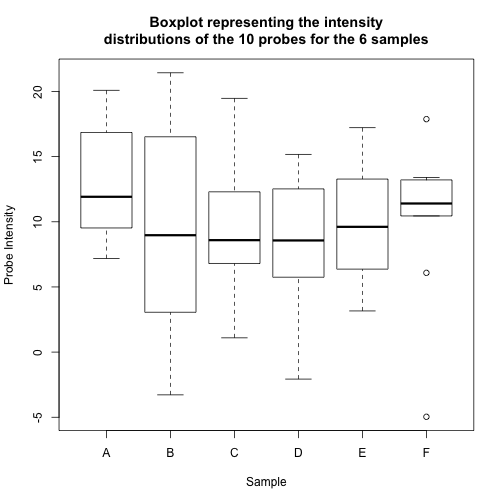

A practical tutorial on S4 programming
======================================
* Author: Laurent Gatto
* Sources:
    * https://github.com/lgatto/TeachingMaterial
    * https://github.com/lgatto/roo
    * https://github.com/lgatto/S4-tutorial

## Experiment
Say we have conducted a microarray experiment using `n` probes across `m`
individuals.

* We can represent the results of this experiment using a matrix
  of size `n` x `m` called `marray`. This matrix stores the intensity for
  probe `1, 2, ..., n` for sample `1, 2, ..., m`.
* The sample annotation can be described in a data.frame `samp_annot`
  with `m` rows and any number of columns.
* The probe annotation can be described in a data.frame
  `prob_annot` with `n` rows and any number of columns.


```r
n <- 10
m <- 6
intensities <- rnorm(n * m, mean = 10, sd = 5)
marray <- matrix(intensities, ncol = m)
marray
```

```
##            [,1]       [,2]      [,3]      [,4]      [,5]       [,6]
##  [1,] 12.217402  3.6434487  9.281794  5.993282  5.847715 14.3835983
##  [2,] 11.068983 -3.1107430 13.220380  8.943930 12.437789 10.2293901
##  [3,]  6.578076  7.1379041 13.593105 14.027848  4.405795  0.3405873
##  [4,] 24.570282 13.4066539  5.822686 13.606583  8.009801  8.4251687
##  [5,] 16.756629  0.7462225 13.016356  5.353832 11.109108 12.3924960
##  [6,] 16.025063 15.6663035  9.767260  8.824534 13.043012 12.4922001
##  [7,] 20.236269  8.6911548  4.158100  6.704244  8.591076 10.7967261
##  [8,]  3.126879 15.0927644 12.947147  9.262157 17.832444  4.6201247
##  [9,] 12.938295  7.2896256 18.536092  4.439990  9.749735 16.2969315
## [10,]  7.217962  9.1042259 10.733673  9.228887  7.394165 15.0606064
```

```r
# sample annotation
samp_annot <- data.frame(sampleID = 1:m,
			 condition = rep(c("WT", "MUT"), each = 3))
rownames(samp_annot) <- colnames(marray) <- LETTERS[1:m]
samp_annot
```

```
##   sampleID condition
## A        1        WT
## B        2        WT
## C        3        WT
## D        4       MUT
## E        5       MUT
## F        6       MUT
```

```r
# probe annotation
prob_annot <- data.frame(geneID = 1:n,
			  pathway = sample(LETTERS, n, replace = TRUE))
rownames(prob_annot) <- rownames(marray) <- paste0("probe", 1:n)
prob_annot
```

```
##         geneID pathway
## probe1       1       D
## probe2       2       S
## probe3       3       O
## probe4       4       K
## probe5       5       E
## probe6       6       Q
## probe7       7       D
## probe8       8       Z
## probe9       9       J
## probe10     10       T
```

```r
marray
```

```
##                 A          B         C         D         E          F
## probe1  12.217402  3.6434487  9.281794  5.993282  5.847715 14.3835983
## probe2  11.068983 -3.1107430 13.220380  8.943930 12.437789 10.2293901
## probe3   6.578076  7.1379041 13.593105 14.027848  4.405795  0.3405873
## probe4  24.570282 13.4066539  5.822686 13.606583  8.009801  8.4251687
## probe5  16.756629  0.7462225 13.016356  5.353832 11.109108 12.3924960
## probe6  16.025063 15.6663035  9.767260  8.824534 13.043012 12.4922001
## probe7  20.236269  8.6911548  4.158100  6.704244  8.591076 10.7967261
## probe8   3.126879 15.0927644 12.947147  9.262157 17.832444  4.6201247
## probe9  12.938295  7.2896256 18.536092  4.439990  9.749735 16.2969315
## probe10  7.217962  9.1042259 10.733673  9.228887  7.394165 15.0606064
```

Now let's add these three pieces to a list:


```r
maexp <- list(marray = marray,
	      samp_annot = samp_annot,
	      prob_annot = prob_annot)
rm(marray, samp_annot, prob_annot, intensities)
str(maexp)
```

```
## List of 3
##  $ marray    : num [1:10, 1:6] 12.22 11.07 6.58 24.57 16.76 ...
##   ..- attr(*, "dimnames")=List of 2
##   .. ..$ : chr [1:10] "probe1" "probe2" "probe3" "probe4" ...
##   .. ..$ : chr [1:6] "A" "B" "C" "D" ...
##  $ samp_annot:'data.frame':	6 obs. of  2 variables:
##   ..$ sampleID : int [1:6] 1 2 3 4 5 6
##   ..$ condition: Factor w/ 2 levels "MUT","WT": 2 2 2 1 1 1
##  $ prob_annot:'data.frame':	10 obs. of  2 variables:
##   ..$ geneID : int [1:10] 1 2 3 4 5 6 7 8 9 10
##   ..$ pathway: Factor w/ 9 levels "D","E","J","K",..: 1 7 5 4 2 6 1 9 3 8
```

```r
ls()
```

```
## [1] "m"     "maexp" "n"
```

Let's access and manipulate some of the elements of the `maexp` list:


```r
maexp$samp_annot # the whole data.frame
```

```
##   sampleID condition
## A        1        WT
## B        2        WT
## C        3        WT
## D        4       MUT
## E        5       MUT
## F        6       MUT
```

```r
summary(maexp$marray[, "A"]) # the A sample
```

```
##    Min. 1st Qu.  Median    Mean 3rd Qu.    Max. 
##   3.127   8.181  12.580  13.070  16.570  24.570
```

```r
(wt <- maexp$samp_annot[, "condition"] == "WT") # WT samples
```

```
## [1]  TRUE  TRUE  TRUE FALSE FALSE FALSE
```

```r
maexp$marray["probe8", wt] # probe8 for WT samples
```

```
##         A         B         C 
##  3.126879 15.092764 12.947147
```

```r
maexp[["marray"]]["probe3", !wt] # probe3 for MUT samples
```

```
##          D          E          F 
## 14.0278483  4.4057952  0.3405873
```


```r
boxplot(maexp$marray,
	main = paste0("Boxplot representing the intensity\n",
		      "distributions of the 10 probes for the",
		      " 6 samples"),
	xlab = "Sample", ylab = "Probe Intensity")
```

 

Now let's extract the first 10 probes for the first 3 samples:


```r
x <- 1:5
y <- 1:3
marray2 <- maexp$marray[x, y]
prob_annot2 <- maexp$prob_annot[x, ]
samp_annot2 <- maexp$samp_annot[y, ]
maexp2 <- list(marray = marray2,
	       samp_annot = samp_annot2,
	       prob_annot = prob_annot2)
rm(marray2, samp_annot2, prob_annot2)
str(maexp2)
```

```
## List of 3
##  $ marray    : num [1:5, 1:3] 12.22 11.07 6.58 24.57 16.76 ...
##   ..- attr(*, "dimnames")=List of 2
##   .. ..$ : chr [1:5] "probe1" "probe2" "probe3" "probe4" ...
##   .. ..$ : chr [1:3] "A" "B" "C"
##  $ samp_annot:'data.frame':	3 obs. of  2 variables:
##   ..$ sampleID : int [1:3] 1 2 3
##   ..$ condition: Factor w/ 2 levels "MUT","WT": 2 2 2
##  $ prob_annot:'data.frame':	5 obs. of  2 variables:
##   ..$ geneID : int [1:5] 1 2 3 4 5
##   ..$ pathway: Factor w/ 9 levels "D","E","J","K",..: 1 7 5 4 2
```

As you can see it's a bit cumbersome and error-prone. There's a much better way
to manipulate "objects" like microarrays.


## Define a class
We can define a class with the `setClass` function. It requires a name
(`MArray`) and a content structure. The different elements of an S4 class are
called slots. When defining the slots, we provide their names and classes as a
named vector or list. You need to create objects with exactly these types of
slots.


```r
MArray <- setClass("MArray",
		   slots = c(marray = "matrix",
			     samp_annot = "data.frame",
			     prob_annot = "data.frame"))
```

The `setClass` function returns a constructor that can be used to create an
instance (object) of the MArray class.


```r
MArray() # an empty object
```

```
## An object of class "MArray"
## Slot "marray":
## <0 x 0 matrix>
## 
## Slot "samp_annot":
## data frame with 0 columns and 0 rows
## 
## Slot "prob_annot":
## data frame with 0 columns and 0 rows
```

```r
# MArray(marray = 1:2) # not allowed since should be matrix
MArray(marray = matrix(1:2)) # now allowed
```

```
## An object of class "MArray"
## Slot "marray":
##      [,1]
## [1,]    1
## [2,]    2
## 
## Slot "samp_annot":
## data frame with 0 columns and 0 rows
## 
## Slot "prob_annot":
## data frame with 0 columns and 0 rows
```

```r
ma <- MArray(marray = maexp$marray,
	     samp_annot = maexp$samp_annot,
	     prob_annot = maexp$prob_annot
	     )
class(ma)
```

```
## [1] "MArray"
## attr(,"package")
## [1] ".GlobalEnv"
```

```r
ma
```

```
## An object of class "MArray"
## Slot "marray":
##                 A          B         C         D         E          F
## probe1  12.217402  3.6434487  9.281794  5.993282  5.847715 14.3835983
## probe2  11.068983 -3.1107430 13.220380  8.943930 12.437789 10.2293901
## probe3   6.578076  7.1379041 13.593105 14.027848  4.405795  0.3405873
## probe4  24.570282 13.4066539  5.822686 13.606583  8.009801  8.4251687
## probe5  16.756629  0.7462225 13.016356  5.353832 11.109108 12.3924960
## probe6  16.025063 15.6663035  9.767260  8.824534 13.043012 12.4922001
## probe7  20.236269  8.6911548  4.158100  6.704244  8.591076 10.7967261
## probe8   3.126879 15.0927644 12.947147  9.262157 17.832444  4.6201247
## probe9  12.938295  7.2896256 18.536092  4.439990  9.749735 16.2969315
## probe10  7.217962  9.1042259 10.733673  9.228887  7.394165 15.0606064
## 
## Slot "samp_annot":
##   sampleID condition
## A        1        WT
## B        2        WT
## C        3        WT
## D        4       MUT
## E        5       MUT
## F        6       MUT
## 
## Slot "prob_annot":
##         geneID pathway
## probe1       1       D
## probe2       2       S
## probe3       3       O
## probe4       4       K
## probe5       5       E
## probe6       6       Q
## probe7       7       D
## probe8       8       Z
## probe9       9       J
## probe10     10       T
```

We can access individual slots from an object using `@` in a similar manner to
`$` with lists:


```r
ma@samp_annot
```

```
##   sampleID condition
## A        1        WT
## B        2        WT
## C        3        WT
## D        4       MUT
## E        5       MUT
## F        6       MUT
```

## Methods
A generic function, or generic for short, is a function that dispatches methods
to their appropriate class-specific implementation. A method `foo` will work in
a way `X` with an object of class `A` and in a different way `Y` with an object
of class `B`.

We define methods using `setMethod`. Before we do so, we need to check if such
a method already exists. If it does, then a generic also exists and we can
proceed normally. If it does not, then we first need to create the generic and
then proceed with the method.

### The `show` method
The `show` method allows to define a convenient and more compact view of an
object when we type its name in the console.


```r
show
```

```
## standardGeneric for "show" defined from package "methods"
## 
## function (object) 
## standardGeneric("show")
## <bytecode: 0x7ff93b17ba70>
## <environment: 0x7ff93a56fd58>
## Methods may be defined for arguments: object
## Use  showMethods("show")  for currently available ones.
## (This generic function excludes non-simple inheritance; see ?setIs)
```

```r
isGeneric("show")
```

```
## [1] TRUE
```

```r
hasMethod("show")
```

```
## [1] TRUE
```
